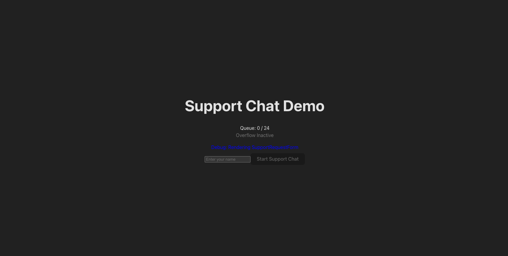
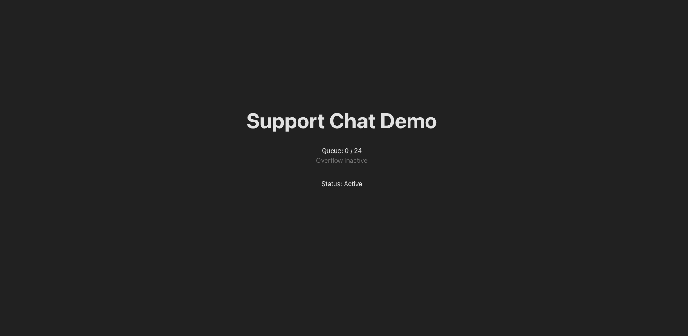

# ChatQueueSystem

A .NET-based API for managing chat queues, agents, and teams.

## Prerequisites
- [.NET 9 SDK](https://dotnet.microsoft.com/download/dotnet/9.0)
- macOS, Linux, or Windows

## Important: Environment Variables

- `OFFICE_END_HOUR`: Set the end of office hours (e.g., `17:00:00` for 5:00 PM). Defaults to `17:00:00` if not set.
```
OFFICE_END_HOUR=23:00:00 dotnet run
```

## Setup Steps

### 1. Clone the Repository
```
git clone https://github.com/imeshujith/ChatQueueSystem.git
cd ChatQueueSystem
```

### 2. Restore Dependencies
```
dotnet restore
```

### 3. Remove Existing Sample Data (Optional)
If you want to start with a clean database, delete the existing database file:
```
rm ChatQueueSystem.API/chatqueue.db
```

### 5. Run the API
```
cd ChatQueueSystem.API
dotnet run
```
The API will start, usually at `http://localhost:8008`.


### 6. Run Unit Tests
To run all unit tests:
```
dotnet test
```

### 7. Test the API (Optional)
You can use the provided shell script to test the API endpoints:
```
bash test_chat_system.sh
```
Or use tools like Postman or curl to interact with the endpoints.

---
## Configuration

## Notes
- If you encounter `Queue is full. Chat refused.`, ensure the database is empty or increase queue limits in your code.

## Project Structure
- `ChatQueueSystem.API/` - Main API project
- `ChatQueueSystem.Application/` - Application logic
- `ChatQueueSystem.Domain/` - Domain entities and interfaces
- `ChatQueueSystem.Infrastructure/` - Data access and infrastructure
